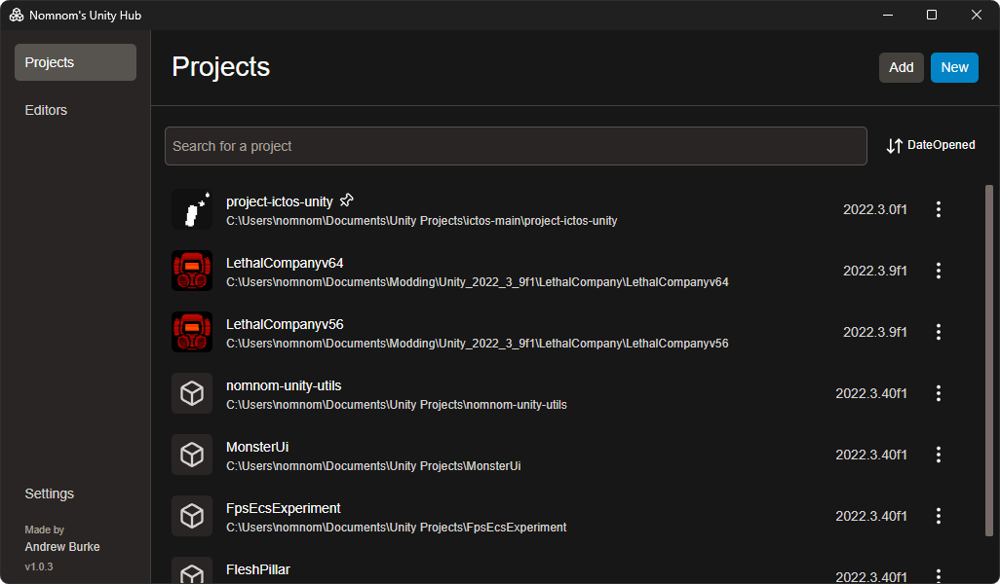
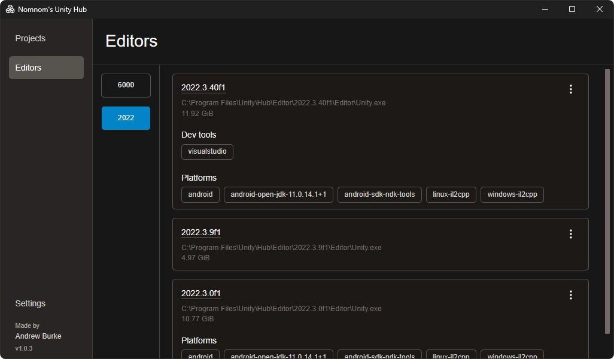
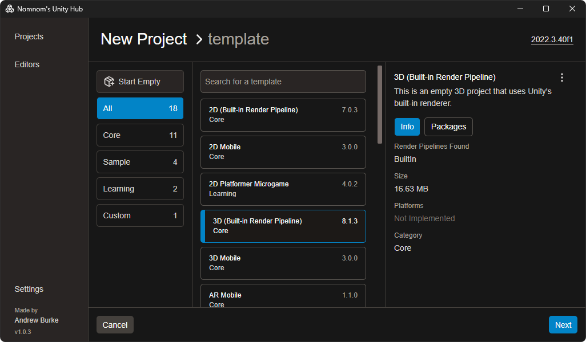
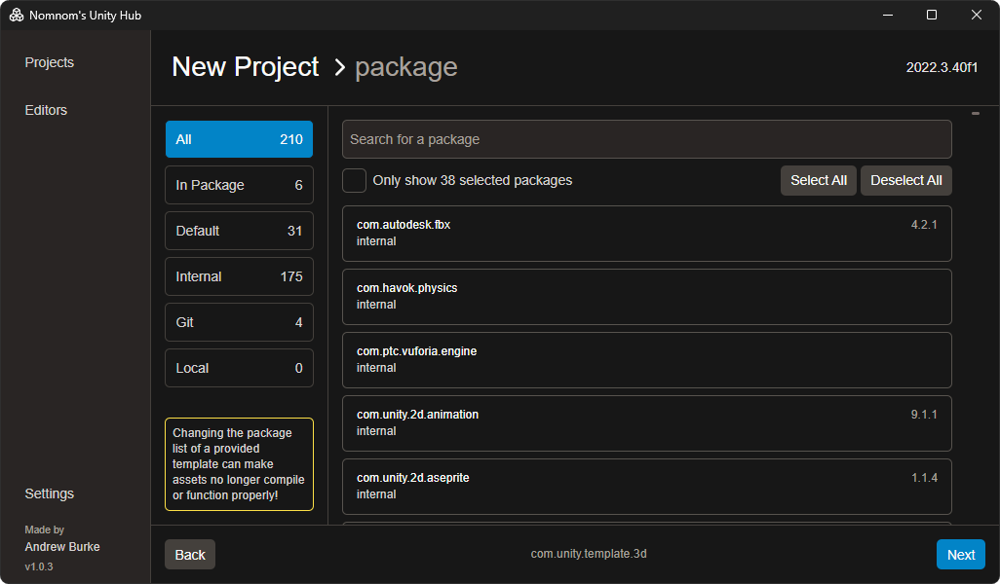
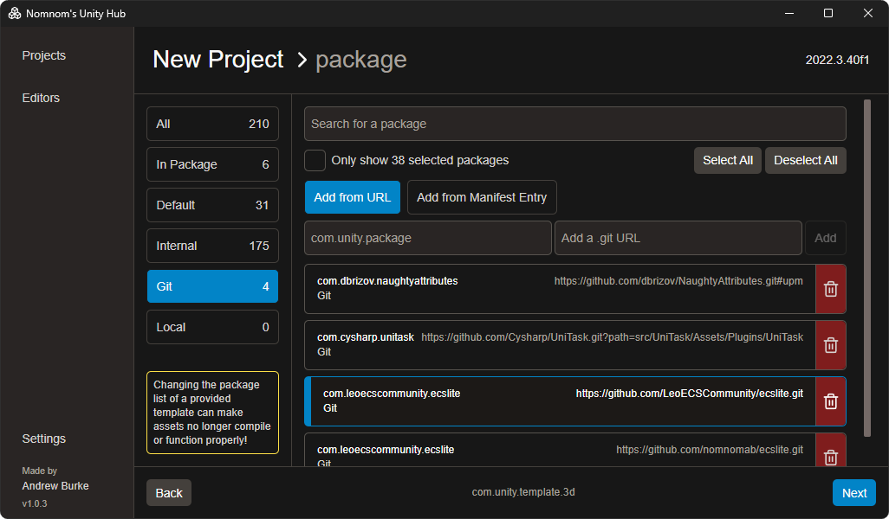
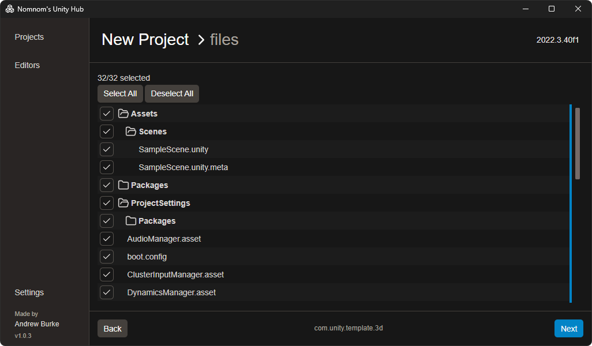
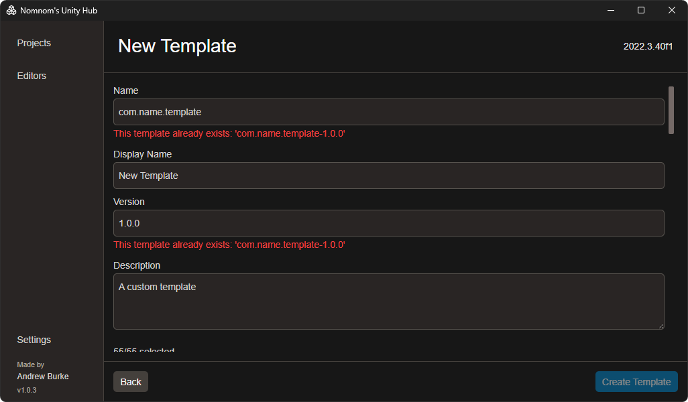

# Nomnom's Unity Hub

## Features

- Written in React + Tauri + Rust
- Low memory usage
- Paginated project list
  - thumbnail.png discovery in project root
- Project creation
  - Select a template to start from, or start from scratch
  - Select the specific packages you want
    - Supports internal packages
    - Supports git packages
    - Supports local file packages
  - Select the files/folders you want from the template
  - Create a template directly from a project
- Template creation
  - Integrated into the project creation
  - The final template file will also be discoverable by the Unity Hub
- Editor version list
  - Can see how large each version's disk size is
  - Can open a version's changelog
  - Can open the version's folder on disk
  - Can see what modules are installed

## Building

```bash
pnpm i

# move into src folder
cd .\src\

pnpm tauri build
```

Then find the exe in `\src-tauri\target\release\`

## Notes

If you know how to get the package versions for a specific unity template, please let me know. Things like the built-in package somehow
have updated package versions that aren't the recommended version, but aren't the versions in their template file anywhere.

## FAQ

### Why does my local package.json file keeps failing to be read?

Makes sure the file is set to UTF8 encoding.

## Screenshots

#### Projects



#### Editors



#### Templates



#### Packages



#### Git Packages



#### File View



#### Template Creation


